# Execution Plan

## Detailed Analysis Summary

### Change Impact Assessment
- **User-facing changes**: Yes — 고객용 주문 인터페이스 + 관리자 대시보드 신규 구축
- **Structural changes**: Yes — 프론트엔드/백엔드/DB 전체 아키텍처 신규 설계
- **Data model changes**: Yes — 매장, 테이블, 메뉴, 주문, 세션 등 데이터 모델 설계 필요
- **API changes**: Yes — RESTful API 전체 설계 필요
- **NFR impact**: Yes — 실시간 통신(SSE), 인증(JWT), 회복성 패턴 적용

### Risk Assessment
- **Risk Level**: Medium
- **Rollback Complexity**: Easy (Greenfield — 기존 시스템 없음)
- **Testing Complexity**: Moderate (PBT + 상태 관리 + 실시간 통신)

---

## Workflow Visualization

```mermaid
flowchart TD
    Start(["User Request"])
    
    subgraph INCEPTION["🔵 INCEPTION PHASE"]
        WD["Workspace Detection<br/><b>COMPLETED</b>"]
        RA["Requirements Analysis<br/><b>COMPLETED</b>"]
        WP["Workflow Planning<br/><b>COMPLETED</b>"]
        AD["Application Design<br/><b>EXECUTE</b>"]
        UG["Units Generation<br/><b>EXECUTE</b>"]
    end
    
    subgraph CONSTRUCTION["🟢 CONSTRUCTION PHASE"]
        FD["Functional Design<br/><b>EXECUTE</b>"]
        NFRA["NFR Requirements<br/><b>EXECUTE</b>"]
        NFRD["NFR Design<br/><b>EXECUTE</b>"]
        CG["Code Generation<br/>(Planning + Generation)<br/><b>EXECUTE</b>"]
        BT["Build and Test<br/><b>EXECUTE</b>"]
    end
    
    Start --> WD
    WD --> RA
    RA --> WP
    WP --> AD
    AD --> UG
    UG --> FD
    FD --> NFRA
    NFRA --> NFRD
    NFRD --> CG
    CG --> BT
    BT --> End(["Complete"])
    
    style WD fill:#4CAF50,stroke:#1B5E20,stroke-width:3px,color:#fff
    style RA fill:#4CAF50,stroke:#1B5E20,stroke-width:3px,color:#fff
    style WP fill:#4CAF50,stroke:#1B5E20,stroke-width:3px,color:#fff
    style AD fill:#FFA726,stroke:#E65100,stroke-width:3px,stroke-dasharray: 5 5,color:#000
    style UG fill:#FFA726,stroke:#E65100,stroke-width:3px,stroke-dasharray: 5 5,color:#000
    style FD fill:#FFA726,stroke:#E65100,stroke-width:3px,stroke-dasharray: 5 5,color:#000
    style NFRA fill:#FFA726,stroke:#E65100,stroke-width:3px,stroke-dasharray: 5 5,color:#000
    style NFRD fill:#FFA726,stroke:#E65100,stroke-width:3px,stroke-dasharray: 5 5,color:#000
    style CG fill:#4CAF50,stroke:#1B5E20,stroke-width:3px,color:#fff
    style BT fill:#4CAF50,stroke:#1B5E20,stroke-width:3px,color:#fff
    style Start fill:#CE93D8,stroke:#6A1B9A,stroke-width:3px,color:#000
    style End fill:#CE93D8,stroke:#6A1B9A,stroke-width:3px,color:#000
    style INCEPTION fill:#BBDEFB,stroke:#1565C0,stroke-width:3px,color:#000
    style CONSTRUCTION fill:#C8E6C9,stroke:#2E7D32,stroke-width:3px,color:#000
    
    linkStyle default stroke:#333,stroke-width:2px
```



### Text Alternative
```
Phase 1: INCEPTION
  - Stage 1: Workspace Detection (COMPLETED)
  - Stage 2: Requirements Analysis (COMPLETED)
  - Stage 3: Workflow Planning (COMPLETED)
  - Stage 4: Application Design (EXECUTE)
  - Stage 5: Units Generation (EXECUTE)

Phase 2: CONSTRUCTION
  - Stage 6: Functional Design (EXECUTE, per-unit)
  - Stage 7: NFR Requirements (EXECUTE, per-unit)
  - Stage 8: NFR Design (EXECUTE, per-unit)
  - Stage 9: Code Generation (EXECUTE, per-unit)
  - Stage 10: Build and Test (EXECUTE)
```

---

## Phases to Execute

### 🔵 INCEPTION PHASE
- [x] Workspace Detection (COMPLETED)
- [x] Requirements Analysis (COMPLETED)
- [ ] User Stories - **SKIP**
  - **Rationale**: 단일 매장/단일 관리자의 명확한 요구사항 문서가 이미 존재. 사용자 유형이 2가지(고객/관리자)로 단순. 요구사항이 충분히 상세하여 별도 스토리 불필요.
- [x] Workflow Planning (IN PROGRESS)
- [ ] Application Design - **EXECUTE**
  - **Rationale**: 신규 프로젝트로 컴포넌트 구조, API 설계, 서비스 레이어 정의 필요. 프론트엔드/백엔드 분리 구조의 전체 아키텍처 설계가 필수.
- [ ] Units Generation - **EXECUTE**
  - **Rationale**: 백엔드 API + 프론트엔드(고객용/관리자용) 등 여러 작업 단위로 분해 필요. 단위별 독립적 설계 및 구현을 위한 구조화.

### 🟢 CONSTRUCTION PHASE
- [ ] Functional Design - **EXECUTE** (per-unit)
  - **Rationale**: 데이터 모델, 비즈니스 로직(주문 처리, 세션 관리), API 엔드포인트 상세 설계 필요.
- [ ] NFR Requirements - **EXECUTE** (per-unit)
  - **Rationale**: 회복성 확장 활성화됨. SSE 실시간 통신, JWT 인증, PBT 프레임워크 선택 등 NFR 평가 필요.
- [ ] NFR Design - **EXECUTE** (per-unit)
  - **Rationale**: NFR Requirements 실행 시 NFR Design도 실행. 회복성 패턴(타임아웃, 헬스체크, 모니터링) 설계 포함.
- [ ] Infrastructure Design - **SKIP**
  - **Rationale**: 배포 환경 미정 (로컬 개발 우선). 인프라 설계는 추후 배포 결정 시 수행.
- [ ] Code Generation - **EXECUTE** (per-unit, ALWAYS)
  - **Rationale**: 실제 코드 구현 필수.
- [ ] Build and Test - **EXECUTE** (ALWAYS)
  - **Rationale**: 빌드/테스트 지침 생성 필수.

### 🟡 OPERATIONS PHASE
- [ ] Operations - **PLACEHOLDER**
  - **Rationale**: 향후 배포 및 모니터링 워크플로우 확장 예정.

---

## Success Criteria
- **Primary Goal**: 단일 매장용 테이블오더 시스템 MVP 구현
- **Key Deliverables**:
  - FastAPI 백엔드 (REST API + SSE)
  - React 프론트엔드 (고객용 + 관리자용)
  - SQLite 데이터베이스 스키마
  - Property-Based Tests + Example-Based Tests
  - 빌드 및 실행 가이드
- **Quality Gates**:
  - 모든 API 엔드포인트 정상 동작
  - SSE 실시간 주문 알림 2초 이내
  - PBT 통과 (Hypothesis + fast-check)
  - 회복성 패턴 적용 (타임아웃, 헬스체크)

---
